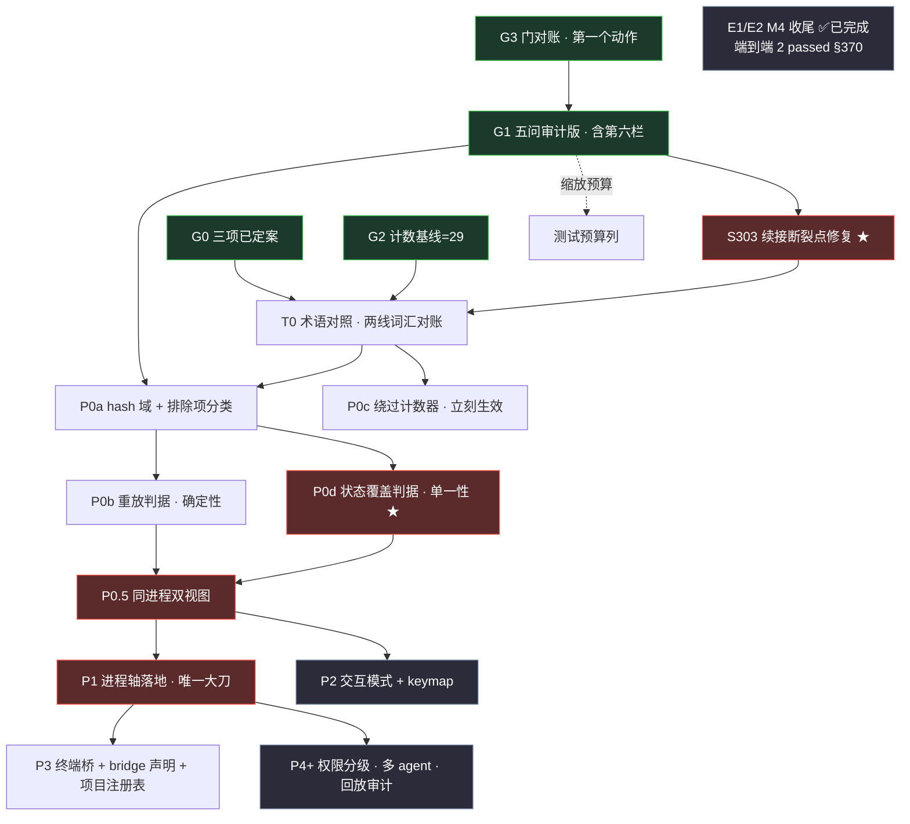

# Cellrix 里程碑与验收标准 · DAG 版 v5.0（目标导向）

> 配套文档：《Cellrix 架构研讨图 v12 · Ω 判别力元公理》＋《Deepseek-handoff》（工程线 M0–M5）
> **纪律只有一份，见 §5（五条）。** 不允许第二份清单（A5）——此处不重复列举，只作引用。

## 🔀 v4 头条：不是一条线，是**两条线的合流点**

**架构线（DAG 的 P 系格子）与工程线（Deepseek 的 M0–M5）是两套不同粒子的体系**——前者管 hash 域 / Intent / 进程轴，后者管 period / refs / GC / 腾位。它们已在多处咬合，且工程线自述「收尾交接……等所有者指示」——**收尾动作已完成，现在就是接收时刻。**

### 交叉点对账表（本次最重要的资产）

| DAG 侧 | 工程线侧 | 状态 |
|---|---|---|
| G1④ transport attach 概念 | **§317** 多 ref：`current`=HEAD + `conversations/<血缘根>`，客户端已接线 | ✅ 已落地，判据可跑 |
| G1② 状态归属分散度 | M0 `layering_test` + `nav_state_test` 的**唯一写者** | ✅ 判据在网，**覆盖面待审计** |
| **E1/E2 支线** | M4② | ✅ **端到端 2 passed（§370）** ⇒ DAG 图刷新 |
| P0b 重放判据（部分地基） | C8 purge/重放复活 · C12 HLC 时钟 · C13 纯函数 | ✅ 地基已落（scope = 事件流 GC 域，非全状态） |
| P0d 状态覆盖（子集） | `nav_state` 唯一写者守的是**视图零写** | 🟡 视图侧子集已绿，**全字段单一性未证** |
| G0② 运行模式=契约层声明 | M3④ mode **周期级声明**、`None` ⇒ 键缺席不回落 | 🚧 **概念互证**：两线没打架，反而在印证 |
| CI-144 意图 | **M5 适配器 ADR（CI-144↔AG-UI）才接入** | ❌ 未进代码 ⇒ **G1① 的答案很可能是「不存在」** |

**三个推论**：
1. **DAG v3 状态已过时**——E1/E2 标着待做，实际已完成端到端；29 项里的「14 新」有一部分已被工程线做成「现状」。**这正是 T0 的真实工作量来源**：它不再是"半天小格"，而是**两线词汇对账的宪法层**。
2. **G1 性质从「摸底」升级为「审计」**——②④ 已有文档答案，任务是**核验声明与代码一致**。
3. 两线内部已有词汇分裂治理实践（§339/§340 统一 driving/partner/survival）⇒ 线与线之间更需要同一套纪律，**T0 优先级因此上升**。

## 当前版本要点（历史修订记录已清理）

- **S303** 走正确性豁免类入表（不挤占其他格）
- **T0** 升级为两线词汇对账 + 独立概念清单，工期 1.5–2 天
- **P0d** 须封住六条旁路（含反序列化）
- **pending intent 不得因重放而自动执行**
- 计数口径：29 为**卡片口径**，T0 后由概念清单生成

---

## ✅ v3 头条（延续）：G0 三项已定案，T0 门禁解除

| G0 项 | 裁定 | 连带影响 |
|---|---|---|
| **① CI-144 意图命名** | 代码 `Ci144Intent`；文档「CI-144 意图」，简称「意图」。**限定并入词本身**，Android 无包名可挂 ⇒ 无冲突（A3b + A5） | T0 得一条确切映射；符合元原则「词从代码来」 |
| **② 运行模式归属** | 归 **① 契约层**（声明语义，agent 不允许运行时切换）。附带纪律：**「切换」不进意图动词表** | ② 视图层 6→5 项，① 契约层 4→5 项；**P2 验收必须区分两种 mode** |
| **③ 失效意图处置** | 目标失效 ⇒ **标记 stale ⇒ 降级需重新确认**。机制：意图携带目标 ref · `apply()` 核对存活 | **P0a 新增一类归类要求**（目标存活）；队列累积走既有三旋钮，**但映射必须证明**（见下） |

> **⚠️ v4.2：「走既有三旋钮」不能只作为声明。** 必须证明映射：队列**超时** / **保留期** / **容量上限** / **人工清理**，各自对应 D0 墓碑 / D1 回收+purge / D2 销毁保 id 的哪一个；**证明不了就列为缺口**，不许用「已有机制覆盖」糊过去。

> **只剩 G1 未跑。** 工期数字仍需 G1 校准后才可对外引用（§5 纪律 4）。

**v2 → v3 改了什么**：① G0 三项落表、T0 解锁；② 层图计数随 G0② 调整（契约层 5 / 视图层 5，总数仍 29）；③ P2 验收区分「运行模式无切换 / 交互模式可切换」；④ P0a 补「目标存活」归类；⑤ P0b 补 stale 近似重放标注。

**v1 → v2 修了什么**：① 工期改为可推导（两套资源假设，废弃不可核验的"6–8 周"）；② 补资源模型；③ mermaid 三处形式错误（伪边、二环、冗余边）；④ 门禁边修正（删 G1→G2）；⑤ 自身计数修正（9→10 格、"四格"→"六格·四要害"、"三格"→"三组"）。

---

## 0 · 前置门禁（不属于 DAG，但必须先过）

| 门禁 | 内容 | 状态 |
|---|---|---|
| **G0 · 研讨区清空** | ① CI-144 命名 → `Ci144Intent`／「CI-144 意图」简称「意图」　② 运行模式 → ① 契约层　③ 失效意图 → stale + 降级重确认 | 🟢 **已定案** |
| **G1 · 五问自查** | ① Intent 泄漏面　② 状态归属　③ WebUI 通信形态　④ transport 是否有 attach 概念　⑤ `render(state)` 是否纯函数 | 🔴 **未跑（唯一残留门禁）** |
| **G2 · 计数基线** | 脚本逐卡清点，确认 11 现状 / 4 待更新 / 14 新 = **29** | 🟢 已核验 |
| **G3 · 门对账**（v4 新增） | 三仓判据各跑一遍，数字 vs 声明 | 🔴 未跑（**第一个动作**） |

**门禁的边（v1 画错，v2 修正）**：

| 边 | 是否存在 | 说明 |
|---|---|---|
| `G0 → T0` | ✅ 硬门禁 | G0 未清空 ⇒ T0 不许开工 |
| `G1 → G2` | ❌ **已删** | G2 是数卡片，逻辑上不依赖 G1 五问。v1 画了这条边，导致"G2 已核验而 G1 未跑"自相矛盾 |
| `G1 → P0a` | ✅ 弱门禁 | G1 结论 informs P0a 的字段归类 |
| `G1 ⇢ BUD` | ✅ 缩放 | G1 结论整体缩放测试预算列（mermaid 中 `BUD[测试预算列]`）| G1 ② 中 ⇒ P1 预算上调；⑤ 中 ⇒ P0.5 预算上调 |
| `G2 → T0` | ✅ 基线 | C4 计数基线 |
| `G3 → G1` | ✅ 前置 | **先对账再审计**：门对账是最小代价的"判据先于声明"执行 |

> **执行顺序（v4 修订）**：`G3 门对账` → `G1 审计版` → `§303 修复` → `T0` → 关键路径。
> **为什么 §303 在 T0 之前**：用户可见痛点 + 判据现成 + 方案已留，且不依赖任何术语对齐。
> **为什么 G1 在 §303 之前**：G1 是只读审计，零写权限、破坏面最小；§303 要改代码（前任在此栽过），放在信任建立之后。

> **G1 决定刀口大小**（半天诊断 vs 2 倍估错数周工期，期望值上划算）。
> ~~G0 未清空 ⇒ T0 不许开工~~ —— **G0 已于 v3 定案，T0 门禁解除。**
> **G1 未跑 ⇒ 本表工期数字不许对外引用**（见 §5 纪律 4）。

---

## 0.5 · G1 审计版 + 已知状态表（v4 新增，随行防误报）

### G1 五问 · 附线索（v4 从"摸底"升级为"审计"）

| # | 问 | 线索 | 审计要点 |
|---|---|---|---|
| ① | Intent 泄漏面（`apply()` 在哪） | **无线索** | **本问是墙**：`apply()` 是 T1 的代码形态，T1 是 Ω 在时间维度的实例 ⇒ 它不在"要做什么"层，在"一切从哪来"层。<br>审计要点：① CI-144 意图按 M5 才进代码——**若确实不存在，写「不存在」并注明 M5 接入点**；② **同时问「apply 能排除哪两个世界」（有 apply / 无 apply）**——答不出 ⇒ 这一格本身就不是判据。<br>⚠️ 依赖它的格子：P0c / P0d / G0③（另有 P0b，共 4 处，以代码实际为准） |
| ② | 状态归属 | M0 `layering_test` + `nav_state_test` 的"唯一写者" | **核验覆盖面**：它守的是「视图零写」还是「全字段单一写入者」？列出覆盖/未覆盖的字段边界 —— **这直接缩放 P0d 预算** |
| ③ | WebUI 通信形态 | HTTP 端点（`GET/PUT /v1/refs`、`POST /v1/periods/tombstone`）+ 事件流文件 | 核验实际形态与端点清单是否一致 |
| ④ | transport attach | §317 多 ref 已落地 | 核验该判据**仍在网且绿** |
| ⑤ | render 纯函数 | **无线索** | 真查（决定 P0.5 预算） |

**第六栏「两线对齐发现」**（G1 输出追加）：DAG P 系格子与 M 体系落地物的对应关系表。
重点裁决：
- **E1/E2 = M4②**：交接文档声明已完成（端到端 2 passed，§370）。**G3 门对账须以判据确认该声明**——若跑出来不符，回滚 DAG 状态（声明是线索，判据是真相）。
- **M3④ 完成口径在交接文档内部有三处矛盾**（🚧 / 剩:无 / 剩①②③）——**用判据运行结果裁决 `mode_wire_opt` 是否在网且绿**，不采信任何一处陈述。

> **声明是线索，判据是真相。** 两者冲突时以判据运行结果为准。

### 已知状态表（否则会把既知红当新缺陷报告）

```
已知 2 red（不修、不当新发现）：agent_loop_probe 声明红 · prove_track_rows 旧红
已知 NEEDS-INPUT（按设计声明缺席，不是红）：chain_e2e_test（:8080 不可达）
已知 5 held · 0 unregistered
已知活 BUG §303（G1 阶段只记录，不修 —— 下一格修）
门数字在文档内有两处口径（60→62 proven、live 110→116）
  ⇒ 以代码跑出为准，对不上按"声明过时"处理
```

### 交接包（2 件 → 4 件）

```
1. Cellrix-architecture-v8.html          架构线宪法
2. Cellrix-里程碑与验收标准.md           本表（DAG v4）
3. Deepseek-handoff.md                   工程线交接（M0–M5）
   注意：它是"声明"，代码里的判据才是"真相"
   另：它自述"工作区草稿，不进项目" ⇒ 放根目录，不进仓库
4. 已知状态表                            见上（并入任务书或单独文件）
```

---

## 0.8 · Ω 判别力：每条判据必须答「它能排除哪个世界」

**Ω（元公理）**：一条断言是判据 ⟺ **它能排除一个世界**。
能答「排除的是哪两个世界」⇒ `V > 0` ⇒ 判据；**答不出 ⇒ 装饰，不许写**。

> 这条把喊了几十轮的「判据必须能红」变成可判命题：**能红 = 存在一个世界让它红 = V > 0**。

**度量**：`V(a; A_good, B_bad) = log₂ [ P(通过 | A) / P(通过 | B) ]`

三处必须写明的修正：
1. **V 带世界对为参数**，不是判据固有属性 —— 换一对世界，V 就变。
2. **本领域中 V 是退化的**：确定性测试 P 只取 0/1 ⇒ V ∈ {0, +∞, −∞}。它是「能不能区分」的是/否，**不是分级度量**，不可用于比较两条判据谁更强。
3. **方向**：`V > 0 ⟹ 能红`；**能红 ⇏ V > 0**（两世界里都 50% 飘红 ⇒ 能红但 V=0）。**V < 0 = 极性反了** ⇒ 用 `A_good / B_bad` 固定极性，不看 |V|。

**P0b / P0d 为何必须并行（由此可推导，不再诉诸直觉）**：两格排除的是**不同的世界对** ⇒ 任一格绿都不能替代另一格。

| 格 | 排除的世界对（A_good / B_bad） | 证的是 |
|---|---|---|
| **P0b** | 重放一致 / 重放漂移 | 确定性 |
| **P0d** | 单一写入者 / 双写入者 | 单一性 |

---

## 1 · 总体 DAG

### Mermaid



### ASCII 备用（渲染器不支持 mermaid 时）

```
门禁（不入环）：   [G0 已定案] ──→ T0
                  [G2 计数基线=29] ──→ T0
                  [G3 门对账] ──→ [G1 五问审计版] ──→ P0a ；G1 ⇢ 缩放预算列

   [G3 门对账] → [G1 审计版] → ┌──────────────────┐ → ┌──────────────────┐
                               │ S303 续接断裂 ★  │   │ T0 两线词汇对账  │
                               │  改代码 · 先仪器化 │   │  宪法层对账       │
                               └──────────────────┘   └───┬──────┬───┘
            ▼      ▼
   ┌──────────────┐  ┌──────────────┐
   │ P0a hash 域  │  │ P0c 计数器   │
   └──┬────────┬──┘  │ 立刻生效     │
      ▼        ▼     └──────────────┘
┌───────────┐  ┌────────────────────────┐
│ P0b 重放  │  │ P0d 状态覆盖 ★ 单一性  │   ← 两者【必须并行】
│ 确定性    │  │      六条旁路全封       │
└─────┬─────┘  └───────────┬────────────┘
      └──────────┬──────────┘
                 ▼
        ┌───────────────────┐
        │ P0.5 同进程双视图 │
        └───┬───────────┬───┘
            ▼           ▼
   ┌──────────────────┐  ┌──────────────────┐
   │ P1 进程轴 ★大刀  │  │ P2 模式+keymap   │ ← 可与 P1 并行
   └───┬──────────┬───┘  └──────────────────┘
       ▼          ▼
┌──────────────┐ ┌───────────────────────┐
│ P3 终端桥    │ │ P4+ 权限·多agent·审计 │ ← 只依赖 P1
└──────────────┘ └───────────────────────┘

已完工（不入并行位）：[E1/E2 M4 收尾 ✅ 端到端 2 passed §370，待 G3 判据确认]
```

### 关键路径

> 关键路径按定义必须**选定分支**（并行段取较长者）。并行记号 `‖` 不得嵌进路径表达式——那是图，不是路径。

**2 人（并行段取较长者 P0d 5–7 天 > P0b 3–4 天）：**

```
S303 → T0 → P0a → P0d → P0.5 → P1 → P3
```

**1 人（全部串行化，P2 必须排在 P1 之后）：**

```
S303 → T0 → P0a → P0c → P0b → P0d → P0.5 → P1 → P2 → P3
```

**关键路径上的七格**：`S303` · `T0` · `P0a` · `P0d ★` · `P0.5` · `P1 ★` · `P3`。
其中**五格要害**（失败即全线停摆）：`S303 ★`、`T0`、`P0d ★`、`P0.5`、`P1 ★`。

**可并行的两组**（不是两格；E1/E2 已完成，不再占用）：

1. `P0b ‖ P0d` —— **必须**并行，理由见 §3
2. `P2 ‖ P1` —— 可并行
3. ~~`E1/E2 ‖ P0a/P0c`~~ —— **已完成**（M4② 端到端 2 passed，§370）

---

### 参考估计（**非目标** · 完整内容见 §7）

> 里程碑是目标导向。以下仅为资源规划参考，**不构成任何一格的退出条件**。

**资源假设：2 人**（假设 A）

| 格 | 人日 | 说明 |
|---|---|---|
| **S303 ★** | 1–2 | 仪器化 + 修复（前任已回退，勿复用其方案） |
| T0 | 1 | **v3 是 0.5，v4 上调**：两线词汇对账，不是半天小格 |
| P0a | 2–3 | |
| P0d ★ | 5–7 | 并行段取较长者 |
| P0.5 | 3–4 | |
| P1 ★ | 5–10 | 1–2 周 |
| P3 首个交付 | 5–8 | 第 1 个外部 TUI 活在 pane 且可交互 |
| **合计** | **22–35** | **= 4.4–7.0 周**（÷5 工作日） |

**资源假设：1 人**（假设 B，全部串行）

| 格 | 人日 |
|---|---|
| S303 + T0 + P0a + P0c + P0b + P0d + P0.5 | 1 + 1 + 2 + 0.5 + 3 + 5 + 3 = **15.5**（下限）；2+1+3+0.5+4+7+4 = **21.5**（上限） |
| P1 + P2 + P3 | 5 + 5 + 5 = **15**（下限）；10 + 5 + 8 = **23**（上限） |
| **合计** | **30–44 = 6.0–8.8 周** |

**不计入**：G3 门对账（分钟级）· G1（0.5 天，另计）· ~~G0 等待~~（已定案）· P4+（未触发）。

> **注：表格与图中的垂直排列 ≠ 执行顺序。** 顺序以依赖边为准：P0b 与 P0d 同为 `P0a → P0.5` 的**并行边**，图上上下罗列只是排版。

**🔴 v4.2 新增：P1 之前必须明确的事件存储数据契约**（两条属**正确性**，不是运维）：

| # | 契约 | 为什么是正确性 |
|---|---|---|
| 1 | **多写入者串行化**（`max+1` 竞态） | 竞态 ⇒ 序号重复 ⇒ 事件流损坏 |
| 2 | **「事件已记 / 效果未做」窗口** | 需 Transactional Outbox 或等价机制，否则状态与外部世界不一致 |

其余（fsync 策略 · 半行恢复 · schema 演进 · 幂等键 · 归档/快照）属运维 ⇒ 进 §6 观察项，**不动 10 格**。
**§303 的仪器化先于修复**：先打印成功响应 / 统计 `sendChat` 定义点 / 确认 period 增量，**再改代码**。

> v1 写"约 6–8 周"：该数字落在假设 B 中段，**不假，但资源假设未声明 ⇒ 不可核验**。这与 v5 把 65.4% 当成开场白是同一类错误——数字可能没错，错在它推不出来。

---

## 2 · 里程碑总表（**目标导向**）

> **本表的组织维度是「要达成的状态」，不是时间。**
> 每格 = 一个**目标** + 一条**退出条件（状态断言）**。退出条件写成「做完 N 天」一律判为装饰（V=0）。
> 工期与预算**不是目标**，已移至 §7 参考估计。

| ID | **目标（达成什么状态）** | **退出条件（状态断言）** | **排除的世界对（V>0 的依据）** | 依赖 | 关键路径 | 变异通道 |
|---|---|---|---|---|---|---|
| **S303 ★** | 任意节点可续接：选中中间节点即从那里继续 | 4/4 绿 **且** 中间节点续接成立 **且** 手动选定的分叉目标未被覆盖 | 续接到选定段 / 续接回最新段 | G1 | ✅ | 集成 |
| **T0** | 两套词汇对上账，且产出独立概念清单 | 概念清单已交付（稳定 ID/定义/owner/状态/代码映射），三套词汇无孤儿无双属 | 概念有唯一家 / 概念无家或两家 | G0 · G2 · S303 | ✅ | CI |
| **P0a** | hash 域完全定义：每个字段已归类 | 全部字段归类完毕；债务型均有退休日期；边界型均写明为何永久 | 字段已归类 / 字段未归类 | T0 · G1 | ✅ | CI |
| **P0c** | 绕过计数不再增长 | 计数器在线，新代码零新增直改调用点 | 无直改调用点 / 存在直改调用点 | T0 | — | CI |
| **P0b** | 确定性：重放能重建同一状态 | 20 个结构性操作 `kill -9` 后重放 hash A == B，且 7 类泄漏全部配齐 | 重放一致 / 重放漂移 | P0a | ✅ | CI |
| **P0d ★** | 单一性：每个状态字段只有一个写入者 | 每个字段点名唯一写入者，且编译期封住全部六条旁路 | 单一写入者 / 双写入者 | P0a | ✅ | CI（compile-fail） |
| **P0.5** | 两个视图消费同一条事件流且状态一致 | 两个 renderer、一个 core、一个 hash；同一 state 渲染两次 diff 为空 | 两视图同状态 / 任一视图自带状态 | P0b + P0d | ✅ | CI |
| **P1 ★** | 事实源活过界面退出 | 关掉界面内容继续跑；重连回原位且 **hash 域** hash 与断开前一致 | 界面退出后内容存活 / 内容随界面停止 | P0.5 | ✅ | 集成 |
| **P2** | 换键位不动协议 | 换一个 keymap 文件 ⇒ 视图变、事实层零改动；模式 owner 在事实层 | 换 keymap 视图变 / 换 keymap 事实层需改 | P0.5 | —（∥P1） | 集成 |
| **P3** | 外部项目零改动接入 | 新增一个项目 = 只加一份 bridge 声明，本系统零改动；第 1 个外部 TUI 活在 pane 且可交互 | 加项目零改动 / 需改本系统 | P1 | ✅ | 演示 |
| **P4+** | 一份声明两个用途 | 权限声明同时驱动确认门配置；整条流可回放审计 | 一份声明两个用途 / 声明与门各写一遍 | P1 | — | 集成（P1 后启用） |

> **新增列用法**：写不出「世界对」的格，本身就是装饰（V=0）⇒ 不许进表。

**约束（非目标）**：测试预算单位 = **需改写的存量测试数**（新增不计）。可计量部分上限 = 5 + 10 + 15 + 15 + 25 + 30 = **100**。属 §7 参考估计，不构成目标。

> ⚠️ **分母待 G3 门对账实测**：此前写「349 存量测试」，该数字无推导式（三仓声明值 296 / 96 / 116 怎么加都对不上）。**改为：占比以 G3 跑出的实测总数为准。** G3 未跑前不填百分比——填了 agent 会拿它算预算。

> **S303 为何能进表而不挤占其他格**：它属 §6 豁免类的**正确性修复**——断的是「选中任意节点从那里继续」这一核心目标的默认路径，不是 feature。挤掉谁都不对，故按豁免类入表。

> **测试预算是工期信号，不是质量指标。** 超限 ⇒ 说明刀口比预估大 ⇒ **停下来重新评估**（停后选项见下表）。
> **G1 自查结果会整体缩放这一列**：中第 ⑤ 问（render 不纯）⇒ P0.5 预算上调；中第 ② 问（状态归属分散）⇒ P1 预算上调。

**停后选项表**（v1 只写"超限即停"，未给后续）：

| 选项 | 适用条件 | 代价 |
|---|---|---|
| **降范围** | 超限 ≤ 50%，且超出的字段可延后 | 该格退出条件缩窄，需记录欠账 |
| **拆两刀** | 超出的部分可独立成一次提交 | 增加一次集成风险 |
| **升预算** | G1 结论已解释超支原因，且原因已消除 | 工期顺延 |
| **回退上一格** | 超限 > 100%，说明上一格没做干净 | 返工，但比硬推进便宜 |

> 驳回项记录：审查曾建议把「P0d 预算可能低估」单列为待修项 —— **驳回**，因为它已是本表既有的 G1 缩放机制，重复记账违反计数纪律。

---

## 3 · 逐格验收标准

### S303 ★ · 续接断裂点修复（v4 新增 · 正确性豁免类）

**为什么它是要害**：硬要求是「能看清一段经历，并选中其中任意一个节点，**从那里继续**」。§303（发送成功 ⇒ 未设续接目标 ⇒ 每条消息开新段）断的正是"从那里继续"的**默认路径**——**这不是体验小毛病，是核心目标的断裂点**。

**⚠️ 前任在此栽过**：已试修失败并回退未提交。**不要直接复用那个失败方案，先仪器化。**

**仪器化（先做，不改代码）**：打印成功响应 · 统计 `sendChat` 定义点 · 确认 period 增量。

| 判据（绿） | 变异（红） |
|---|---|
| 点最新节点 ⇒ **4/4 通过** | 点最新 ⇒ 仍开新段 ⇒ 红 |
| 选中任意中间节点 ⇒ 从那里继续 | 只有最新节点可续接 ⇒ 红（那是退化，不是修复） |
| **手动选定续接目标（分叉入口）后发送 ⇒ 新段 parent == 选定段** | **发送后目标被重置为最新段 ⇒ 红** |

> **第三条是防回归边界**：fork 分叉入口已落地（§361 `fork_entry_test` 6 passed）。若把 S303 修成"发送 ⇒ 目标 = 最新段"，会**覆盖用户手动选定的分叉目标**——把已绿的东西修回归。

**Ω 检验**：排除的世界对 = **续接到选定段 / 续接回最新段**。若只验"点最新 ⇒ 4/4"，这两个世界不可分 ⇒ V = 0 ⇒ 假绿。

**退出条件**：4/4 绿，且**中间节点**续接成立（不只是最新），且**手动选定的分叉目标不被覆盖**。

---

### T0 · 术语对照 · **两线词汇对账**（v4 升级）
**目标**：把已完成的 15 项与四层 + 进程轴的命名对上，**并把架构线词汇与工程线（M0–M5）词汇对上账**。**不动代码**——乱的不是楼，是名字。

> **v3 估 0.5 天，v4 上调为 1 天。** 原因：29 项里的「14 新」有一部分已被工程线做成「现状」（E1/E2 = M4② 已完成即是证据）。T0 因此不只是层名映射，还是**两套粒子的对账**——这正是它作为「宪法层」的真实工作量。
> 已有先例：工程线内部 §339/§340 做过 driving/partner/survival 的统一治理，线与线之间需要同一套纪律。

| 判据（绿） | 变异（红） |
|---|---|
| 每个新层名能指出至少一个旧文件 | 增删任一层名 ⇒ 出现孤儿 ⇒ 红 |
| 每个旧模块能指出它归属的新层 | 任一无家概念未被发现 ⇒ 红 |
| 29 项计数与逐卡清点一致（C4 **弱自洽**） | 徽标之和 ≠ 29 ⇒ 红 |
| **徽标随 T0 重数**（11/4/14 分布会因工程线已落地项而变） | 只改总数不改分布 ⇒ 红（总数 29 基线不变，但「新」可能转「现状」） |
| **交付独立概念清单**（稳定 ID · 定义 · owner · 状态 · 代码映射） | 只交层名映射、没交清单 ⇒ 红 |
| **三套词汇对账完成**（架构线 · 工程线 · CI-144 协议族） | 漏一套 ⇒ 红 |

**G0 定案带来的三条确切映射**（T0 必须包含）：

| 代码词 | 文档词 | 简称 | 依据 |
|---|---|---|---|
| `Ci144Intent` | CI-144 意图 | 意图 | G0① · A3b + A5 |
| `config.rs` 的 `Option<Mode>`（drive/partner/survive） | 运行模式（① 契约层） | — | G0② · 声明语义 |
| — | 交互模式（② 事实层） | — | G0② · 可切换，状态语义 |

**退出条件**：对照表可提交，`grep` 任一旧名能找到映射行。
**🟢 门禁状态**：G0 已定案 ⇒ **门禁解除**（无门禁阻挡）。
> ⚠️ **措辞澄清**：「门禁解除」≠「现在就做」——执行序上 T0 仍在 **S303 之后**（见 §0 门禁边）。

---

### P0a · hash 域 + 排除项分类
**目标**：显式定义 `hash_domain = state_tree − 排除清单`，每项排除标注类型。

**Ω 检验**：排除的世界对 = **字段已归类 / 字段未归类**。

| 判据（绿） | 变异（红） |
|---|---|
| 每个状态字段都被归类：在域内 / 债务型排除 / 边界型排除 | 新增一个未归类字段 ⇒ 红（否则清单会自己长成第二个事实源） |
| 债务型排除项**全部带退休日期** | 债务型无退休日期 ⇒ 红 |
| 边界型排除项**全部写明为何永久** | 边界型被要求写退休计划 ⇒ 红（那是编的） |

**排除项分类表**（必须显式，不得混为一类）：

| 类型 | 例子 | 性质 |
|---|---|---|
| **债务型** | HashMap 迭代序、wall-clock、随机 id | 有退休日期，会归零 |
| **边界型** | 外部进程输出、活状态 | **永久排除**，不可能进域 |

**⚠️ G0③ 引入的新状态量：目标存活**（stale 判定的输入，必须归类）：

| 目标类型 | 存活由谁决定 | 归类 | 重放后果 |
|---|---|---|---|
| **内部目标**（pane / tab / 意图队列） | 事件流派生 | **在 hash 域内** | stale 标记可重现 |
| **外部目标**（PTY 桥接进来的进程） | 在事件流之外 | **边界型排除** | stale 标记**不可重现** ⇒ P0b 需标为「近似重放」 |

> 不归类会让 P0b **假绿**——重放时 stale 判定依赖外部活状态，而外部状态不在事件流里。
> ⚠️ **挂起队列不在清单里** —— 它由事件流重放派生（纯数据），可在域内。早先版本曾把它列为边界型，是错的。

**退出条件**：`hash_domain` 定义落盘，脚本可枚举所有字段并断言已归类。

---

### P0c · 绕过计数器
**目标**：老代码允许直通但挂计数器；**新代码一律不准直接改状态**。这个数字就是剩下的债，**且它不再增长**。

| 判据（绿） | 变异（红） |
|---|---|
| 计数器可读、可 CI 输出 | 新增一个直改状态的调用点 ⇒ 计数 +1 ⇒ 红 |

**检测机制（v1 缺失 ⇒ 验收不可执行）**：

清单只能管**存量**，发现不了**增量**。必须补静态检测，否则这条变异是空话。

1. **`bypass!()` 宏** —— 所有绕过 `apply()` 的直改点必须显式调用该宏，宏内计数 +1；CI 读取计数并断言不增。
2. **CI grep** —— 对 `state.` 直写模式做正则扫描，出现未走宏的新增点即红。
3. 兜底：两者结果不一致 ⇒ 红（说明有漏网的写入点）。

**退出条件**：计数器上线并接入 CI，数字不再增长即可（**不需要归零**——归零是 P0d 的事）。

---

### P0b · 重放判据（证**确定性**）
**目标**：20 个结构性操作 → `kill -9` → 新进程重放事件流 → hash A == B。
操作集**按 7 类泄漏配齐**，不只写"20 个"。

**Ω 检验**：排除的世界对 = **重放一致 / 重放漂移**。

| 判据（绿） | 变异（红） |
|---|---|
| 重放后 hash 相等 | **故意漏一条事件 ⇒ 仍相等 ⇒ 红**（判别力为 0） |
| 漏一条事件 ⇒ hash 必须不等 | 删掉一个已归类字段的写入 ⇒ 仍相等 ⇒ 红 |

**7 类泄漏必须配齐**：wall-clock 时间 · 随机 id · HashMap 迭代序 · 外部 I/O · 浮点累积 · 并发序 · 环境依赖（cwd/env）。

**⚠️ v4.2 补：最终 hash 不能单独证明以下四项**，需配套针对性变异：

| 需证 | 配套变异 |
|---|---|
| 所有改变状态的事件都被写入 | 显式列出 hash 覆盖字段与规范化序列化规则 |
| 只有一个写入者 | 归 P0d（本格不证） |
| 事件记录足以复现外部副作用 | **外部副作用单列，不进 hash 等价判据** |
| 序列化顺序与 hash 输入稳定 | 打乱字段顺序 ⇒ hash 必须不变 |

**「漏一条事件 ⇒ hash 必须不等」的作用域**：只对**影响所选 hash 域**的事件成立。对不影响 hash 域的事件不成立——因此这条变异**不能**推广为「任意事件漏写都能检出」。

**⚠️ G0③ 带来的例外标注**：涉及**外部目标**的 stale 判定需在操作集中显式标为**近似重放**（语义接近，不保证 hash 相等）。不标注会让 P0b 在全绿时给出错误的安全感——它证的是"结构性可重放"，不是"外部世界可重放"。

**🔴 v4.2 新增硬约束（此前完全漏掉，属安全漏洞）**：

> **重放只重建持久化的历史状态。**
> **外部存活检查属于 apply 时的实时前置条件，不是重放产物。**
> **未获重新确认的 pending intent，不得因重放而自动执行。**

这一条不写，G0③ 的 stale 机制就是纸糊的——重放会静默执行一批人类从未批准的意图。配套要求：

| 项 | 要求 |
|---|---|
| 审计当时观察结果 | 「目标存活检查结果」作为**观测事件**记录（属事实域，不是变更单元） |
| check-then-act 竞争 | 目标可能在检查后、执行前消失 ⇒ 需**代次号 / 原子条件**或等价机制 |
| 重放语义 | 重放 **≠** 重做外部副作用 |

**退出条件**：变异测试全在 CI 里，且漏事件必红。

---

### P0d ★ · 状态覆盖判据（证**单一性**）
**目标**：每个状态字段**点名唯一写入者**。这是全表最要紧的一格——它补的正是"单一事实源至今无法证伪"那个洞。

**Ω 检验**：排除的世界对 = **单一写入者 / 双写入者**。注意第二写入器若是确定性的，两个世界在 hash 上不可分 ⇒ 必须靠编译期机制而非 hash 来分离。

| 判据（绿） | 变异（红） |
|---|---|
| 每个字段有且仅有一个写入者 | **注入第二写入器 ⇒ 红** |
| — | **该第二写入器即使是确定性的（能被日志驱动）也必须红** —— hash 相等证不了"只有一本账"（实测双源系统全绿，判别力 0） |

**注入机制**（此前版本缺失，导致验收不可执行）：

1. **编译期（推荐）** —— 字段包成只能由 `IntentApplier` 写入的 newtype，用 `trybuild` 跑 compile-fail；第二写入器**编译不过** ⇒ 红。
2. **运行时** —— `#[cfg(test)]` 写入追踪器；但**覆盖率本身就是漏洞**，漏一个写入点就假绿。

**⚠️ v4.2 补：newtype 必须封住旁路，否则 compile-fail 只是摆设。** 前提清单（缺一则该格验收无效）：

| 旁路 | 封法 |
|---|---|
| **字段不公开** | 字段必须私有，不暴露 `pub` |
| **反序列化** | `Deserialize` 实现必须走 `apply()`，**不得**绕过直接构造——这是最大的一条旁路 |
| **内部可变性** | 禁止 `Cell` / `RefCell` 绕过写入入口 |
| **模块可见性** | 写入 API 所在模块之外不得构造该 newtype |
| **测试工具** | `#[cfg(test)]` 构造器与 fixture 同样受约束 |
| **静态依赖检查** | 除 `IntentApplier` 外，无其他模块依赖写入 API |

> 选 ① 的理由是**工程上的**（编译期保证不依赖覆盖率），不是逻辑上的——务必与逻辑判据区分开。
> **一个 compile-fail 样例 ≠ 完整证明**：需同时具备上表六项，缺任一项则该格判据无效。

**退出条件（v4.2 补）**：**绕过计数器归零**——P0c 的棘轮在 P0d 完成后必须降到 0。此时所有直改点已被 newtype 从编译期排除，计数理应为 0；不为 0 ⇒ 有漏网写入点 ⇒ 红。

**退出条件**：newtype 封装完成，`trybuild` compile-fail 测试在 CI 中红得出来。

> **C2 修正**：P0c 写「归零是 P0d 的事」，但 P0d 此前没有归零判据 ⇒ 补：**绕过计数器归零**（P0c 的棘轮在 P0d 完成后必须降到 0）。此时所有直改点已被 newtype 从编译期排除，计数理应为 0；不为 0 ⇒ 有漏网写入点 ⇒ 红。

---

### ⚠️ 为什么 P0b 与 P0d 必须并行

> **P0b 证确定性**（抄两遍一样）
> **P0d 证单一性**（每个字段只有一个写入者）
> **只做 P0b = "抄两遍一样就宣布只有一本账"。**

两者正交，缺一不可。串行做会在 P0b 全绿后产生"已经证完了"的错觉。

---

### P0.5 · 同进程双视图
**目标**：切进程边界之前，先让两个 renderer 在同一进程内消费同一条事件流。
**理由**：IPC 会冻结 API，而意图词汇表还在 churn。

| 判据（绿） | 变异（红） |
|---|---|
| 两个 renderer · 一个 core · 一个 hash | 任一 renderer **自带状态** ⇒ 红 |
| — | **同一 state 渲染两次 ⇒ 字符网格 diff 必须为空** |

> 变异 2 是 v3 带回的：**"自带状态" ≠ "render 纯"** —— render 里藏时间戳或随机 ID，renderer 完全无状态，照样绿。而 grid grounding 的构造性保证全靠它。

**退出条件**：两个 renderer 的 grid diff 恒为空，且该 diff 测试在 CI 中可自动跑。

---

### P1 · 进程轴落地（唯一大刀）
**目标**：transport 从模块升为进程边界；`list-sessions` / `attach` / `delete` 三件套；URL 三段式；事件广播双编码。

| 判据（绿） | 变异（红） |
|---|---|
| 关掉界面，里面的东西继续跑 | 界面退出 ⇒ 内容停 ⇒ 红 |
| 重连回原位（同一 session） | 重连 ⇒ 状态不一致 ⇒ 红 |
| URL 定位 session：`/my-session` 存在则 attach、不存在则新建 | URL 语义不成立 ⇒ 红 |

**v4.2 补：daemon 验收不能只有「关掉界面继续跑」这一条。** 必须覆盖：

| 场景 | 判据 |
|---|---|
| daemon **崩溃 / 重启恢复** | 重启后状态由事件流重建（接 P0b） |
| **多客户端竞争** | 两个 client 同时 attach ⇒ 状态一致，无写冲突 |
| **断线重连** | 重连回原位（同一 session） |
| **socket 权限** | 起步仅本地 unix socket，权限位正确 |
| **协议版本** | 版本不匹配 ⇒ 明确拒绝，不静默降级 |
| **背压** | 慢客户端不拖垮 daemon |
| **会话删除语义** | `delete-session` 后资源释放、句柄失效 |

**退出条件**：`kill` 客户端进程后 daemon 内的 pane 仍在运行，重连后 hash 与断开前一致。

> **限定：这里的 hash 必须是 hash 域的 hash**（P0a 定义的域）。边界型排除项（外部进程输出、活状态）本就该不等 —— 不限定会**假红**。

**⚠️ 已知且接受的风险敞口**：P1 引入 attach / URL 即引入访问面，而权限分级在 P4+ 才动工。
决策：**起步只用本地 unix socket，不绑 TCP；认证推迟到 P4+**。这是显式接受的敞口，不是疏漏。

---

### P2 · 交互模式 + keymap 数据化（可与 P1 并行）
**目标**：模式 owner = **② 事实层**，视图层只读渲染。keymap 是数据。

**⚠️ G0② 后必须先分清两种 mode**（否则本格验收自相矛盾）：

| | 运行模式 | 交互模式 |
|---|---|---|
| owner | **① 契约层**（声明） | **② 事实层**（状态） |
| 能否切换 | **不能**（agent 不允许运行时切换） | **能**（normal/pane/tab/locked） |
| 意图动词 | **无**（「切换」不进动词表） | `SwitchMode` 合法 |
| 来源 | `config.rs:255` `Option<Mode>`<br><span style="color:var(--orange)">⚠️ **行号与字段状态待 G1 核验**：工程线称 `config.rs:242` + `#[serde(default)]`（⇒ `None` 不可达，**待改**）——真伪由判据裁决</span> | Zellij mode 系统 |

| 判据（绿） | 变异（红） |
|---|---|
| 换一个 keymap 文件 ⇒ 视图变，事实层零改动 | **交互模式落视图层本地 ⇒ 红** |
| agent 能 `QueryMode` / `SwitchMode`（**仅交互模式**） | mode 不在事件流中 ⇒ agent 读不到 ⇒ 红 |
| 运行模式只在契约层出现，无任何切换入口 | **出现 `SwitchRunMode` 类意图 ⇒ 红**（不存在的操作不给名字，A4） |

> **红线是归属不是表示**：enum 还是字符串是表示层选择；一旦落进视图层本地，agent 就**失去事实源**。

**退出条件**：换 keymap 文件无需重新编译事实层；底栏按键提示从 keymap 数据自动生成。

---

### P3 · 终端桥 + bridge 声明 + 项目注册表（三者同批）
**目标**：外部 TUI 变成活的、可输入的 pane。
**首个可交付（5–8 天）**：**第 1 个外部 TUI 活在 pane 里且可交互** —— 此后路径终点有定义，不再是"持续"。

| 判据（绿） | 变异（红） |
|---|---|
| 新增一个项目 = 只加一份 bridge 声明，本系统**零改动** | 需要改 Cellrix 代码才能接入新项目 ⇒ 红 |
| 一个外部 TUI（helix / htop / 另一项目界面）活在 pane 里且可被语义感知 | 只显示不能交互 ⇒ 红（那是截图不是桥） |

**v4.2 补：PTY 桥归入适配层即可，但不能因此忽略运行时契约。** 必须覆盖：进程退出码 · 终端尺寸变化（SIGWINCH）· 信号转发 · 环境变量 · 超时 · 进程清理（孤儿 PTY）· 外部命令权限。

> **三者是一件事，拆开做会得到空壳。**

**退出条件**：接入第 2 个项目时，Cellrix 侧 diff 为空。

---

### P4+ · 权限分级 · 多 agent · 回放审计
**目标**：一份声明两个用途——权限声明即确认门配置。

| 判据（绿） | 变异（红） |
|---|---|
| 一份 `skill.toml` 同时驱动能力门与确认门 | 两处配置不一致 ⇒ 红 |
| 整条事件流可回放审计 | 回放结果 ≠ 运行时状态 ⇒ 红 |

**⛔ 触发条件**：出现第二个 skill 提供者才动工（**且 P1 已完成**）。WASM 沙箱同理（Zellij 用 wasmi 解释器而非 JIT，成熟项目主动放弃重量级方案本身就是信号）。

---

## 4 · 并行支线

| 支线 | 内容 | 依赖关系 | **判别方式** |
|---|---|---|---|
| ~~**E1/E2**~~ | ~~M4 收尾：失败四类具名 + 集合内转移~~ | ✅ **已完成**（M4② 端到端 2 passed，§370） | 已从并行支线移除 |
| **P2** | 依赖 P0.5，可与 P1 并行 | P2 只依赖 P0.5 | P2 不触碰 transport / 进程边界代码 |
| **P4+** | 只依赖 P1，**P1 完成后可插入** | 仅 P1 | v4.2 措辞修正：「随时」与依赖关系矛盾 ⇒ 改为「P1 完成后」 |

> v1 把"互不依赖"当作不可验证的断言直接画进图。**判别方式必须可判**：独立性 = 改动文件集不相交，可在 PR 上机械核验。

---

## 3.5 · 逻辑链条闭环（**验证的是项目推理链，不是表格画得对不对**）

> 里程碑表结构正确 ≠ 项目逻辑闭合。本节验证的是**推理链本身**：
>
> ```
> Ω 元公理 → 公理/约定 → 四层+轴 → 概念 → 不变量 → 里程碑 → 判据/变异
>      ↑______________________________________________________|
> ```
>
> **闭合 = 双向**：正向每个概念有家、每格证某条不变量；反向每条不变量都被某格证（无悬空）。

脚本：`cellrix_logic_verify.py`。**概念从架构图 HTML 真实解析**（不手抄副本——副本会漂移，漂移就是第二本账）。

```
概念 29（11 现状 / 4 待更新 / 14 新） · 层 5 · 里程碑 11 · 不变量 16 · 公理 8
推导链：A0 → Ω → T1 → A2 → A3a → A3b → A4 → A5
✓ 逻辑链条闭合
自测 12/12 ✓ 验证器自身 V>0
```

### §0.9 已知缺口清单（**唯一事实源**）

> **为何外置**：此前这 16 条硬编码在 `cellrix_logic_verify.py` 内部 ⇒
> 文档与脚本各存一份，改一边另一边不知 ⇒ **第五处双源**。
> 现改为 MD 声明、脚本解析；脚本内不再保留副本（K13 校验）。

| 缺口名 | 状态 | 何时闭合 |
|---|---|---|
| 意图入口 apply | 未进代码（M5 适配器 ADR 才接入） | G1① |
| 终端桥 PTY | 未实现 | P3 |
| bridge 声明 | 未实现 | P3 |
| 项目注册表 | 仅加字段 | P3 |
| 确认门 | 未实现（依赖 P0d 写入者收敛） | P0d 后 |
| 复活 Resurrection | 未实现（P0b 验收后成立） | P0b |
| keymap 数据化 | 未实现 | P2 |
| 守护进程边界 | 未实现 | P1 |
| URL 寻址 | 服务端已支持多名字，客户端只认 current | P1 |
| attach / detach | 未实现 | P1 |
| 事件广播双编码 | 未实现 | P1 |
| 权限分级 · 模态 | 未实现（**注意：一卡两概念，T0 拆**） | P4+ |
| 模型适配 | 仅留接口 | P4+ |
| 字符网格 grid | 未实现（依赖 render 纯） | P0.5 |
| 交互模式 | 未实现（owner 在 ② 事实层） | P2 |
| 段自带序号 | 契约层已定，代码未落 | T0 |

> **K13**：脚本解析出的缺口必须与本表逐项一致；任一缺口名不在层图中 ⇒ 报红（防"图外漂浮的缺口"）。

### 首轮真跑抓到的 4 处断点（已修）

| # | 断点 | 性质 | 修法 |
|---|---|---|---|
| 1 | **P0c 不证任何不变量** | 它证的是"绕过不增长"（棘轮），但**不变量表里没有这一条** | 新增不变量 **棘轮(绕过不增长)** → P0c |
| 2 | **P4+ 不证任何不变量** | 标识符不一致：不变量表写 `P4`，里程碑表写 `P4+` | 统一为 `P4+`（A5：一物一名） |
| 3 | **「声明即门配置」无格证它** | 同上，id 不匹配导致 | 同上 |
| 4 | **URL 寻址 未声明缺口** | 图上标"新"但不在已知缺口清单 ⇒ 图外漂浮 | 补入 KNOWN-GAPS |

> **第 2/3 条最有代表性**：同一个东西两个名字，导致链条在标识符层面断开——这正是 A5 要防的，且它不是靠阅读能发现的，是靠双向闭合检查逼出来的。

### 16 条不变量 ⇄ 里程碑（双向闭合表 · 每条含**失败路径**）

> **缺口 1 已修**：此前 14 条全部只定义成功路径 —— 验证的是"世界正常时不变量成立"。
> 而事件溯源的价值恰在失败时（重放 / 复活 / 恢复）。现每条补 failure：**崩溃或中断时如何**。

| 不变量 | 由谁证 | 溯源 | **失败路径（崩溃/中断时）** |
|---|---|---|---|
| 棘轮(绕过不增长) | P0c | T1 | 计数器持久化：重启后不归零、不重复计数 |
| C1 反查唯一 | T0 | A5 | 清单是唯一事实源；HTML 卡片只引用 ID，不得自带定义 |
| C2 无概念占两层 | T0 | A5 | 同维度重名即红；跨维度双标需显式标双属主 |
| C3 无概念无家 | T0 | A5 | 孤儿检测独立于排版：改卡片边界不影响清单 |
| C4 计数自洽 | G2 · T0 | A5 | 计数由清单生成；手写数与清单不符即红 |
| T1 二分无第三类 | P0a · P0d | T1 | 重放遇非意图非事实 ⇒ 即时红，不许静默归类 |
| **确定性(可重放)** | P0b | A0 | **杀进程于任意时刻（含写入中途）⇒ 恢复后仍重放到同一 hash；半行必须拒绝而非截断接受** |
| 单一性(单写入者) | P0d | T1 | 并发下仍唯一：冲突由串行化吸收，不产生第二写入路径 |
| 渲染纯度 | P0.5 | A4 | 渲染中途中断 ⇒ 已输出部分与完整渲染前缀一致（无半帧） |
| **进程存活** | P1 | A0 | **daemon 崩溃（非优雅退出）⇒ 重启可恢复；客户端断连期间状态不丢** |
| 协议稳定 | P2 | A5 | keymap 损坏/缺失 ⇒ 回落默认且不改事实层，不许半加载 |
| 外部零改动接入 | P3 | A4 | 外部进程崩溃 ⇒ 记录退出码并转终态，不留悬空 pane |
| 续接可达 | S303 | A0 | 发送中途失败 ⇒ 目标**不**被改写为最新段 |
| **声明即门配置** | P4+ | A5 | **审批中途进程退出 ⇒ pending 保持待批，重放后不得自动执行** |
| **序号单调无重复** 🆕 | P0b · P1 | A0 | **并发追加下 max+1 竞态 ⇒ 重号即红；崩溃后不得出现空洞或重号** |
| **无副作用窗口** 🆕 | P1 | A0 | **「事件已记/效果未做」⇒ outbox 或等价机制收敛；崩溃后窗口可检测** |

> 🆕 两条为**缺口 3（事件流物理契约）**补入。它们此前标为"P1 前的正确性契约"却**不在不变量表里** ⇒ 按 L6 是**悬空的**，无人负责。现归 P0b/P1 证。

### 闭合的定义（12 条不变量）

| # | 检查 | 未闭合意味着 |
|---|---|---|
| L1 | 推导链无环 | 循环论证 |
| L2 | 无未定义符号 | 引用了不存在的东西 |
| **L3** | **T1 不得派生自 A0** | **已撤回的推导复活**（A0 为真时 T1 仍可为假） |
| L4 | 每条公理至少一次命中 | 该公理是填充物 |
| **L5** | **每格都证某条不变量** | 该格是装饰 |
| **L6** | **每条不变量都有格证它** | 不变量悬空，无人负责 |
| L9 | 世界对全局唯一 | 两格重复，其一冗余 |
| L10 | 退出条件不含时间词 | 退回工期导向 |
| L11 | 依赖完整 | 计划不可执行 |
| L12 | 缺口必须在案 | 图外漂浮的未声明项 |
| C2 | 概念不占两层 | 一物两家 |
| C4 | 计数自洽（29 = 11+4+14） | 数字漂移 |
| **L13** | **每条不变量必须声明失败路径** | **只验成功路径 ⇒ 崩溃时不变量无人负责** |

### 验证器自己被抓到的两个缺陷（诚实记录）

1. **概念名解析污染**：tag 文本（"新"/"双属主"）被并进概念名 ⇒ 29 个概念全部错位
2. **C2 检查是装饰（V=0）**：用 dict 存概念，dict 天然去重 ⇒ "占两层"**永远不可能触发**。改为保留 `recs` 列表后，该检查才真正能红

> 第 2 条尤其值得记住：**一条写在文档里、看起来在检查、但机制上不可能失败的规则，就是装饰。** 它在注入缺陷前一直显示"通过"。

### 补齐的两个缺口（本轮）

| 缺口 | 症状 | 修法 |
|---|---|---|
| **1 · 不变量只验成功路径** | 14 条全是 happy path，崩溃/断连/部分写入**一条都没有** | 每条补 `failure` 字段；新增 **L13** 检查：无失败路径 ⇒ 红 |
| **3 · 事件流物理契约在表外** | `max+1` 竞态与 outbox 窗口标为"P1 前的正确性契约"，却**不在不变量表** ⇒ 按 L6 悬空 | 新增两条不变量，归 P0b / P1 证 |

> **为什么这俩要一起修**：物理契约若不进表，它就是"写在文档里但没人负责"的东西——而 L6 存在的意义正是抓这类悬空。此前它躲过了检查，只因为它压根没进表。

### 本轮「PASS 是假的」——产物级变异测试抓到的 4 个真缺陷

> **此前报的"通过"是幻觉**：脚本自己说 PASS，但 PASS 这个结论本身没被验证。
> 于是做了**产物级变异测试**：直接改坏真实 HTML / MD，看验证器红不红（`cellrix_mutate_artifacts.py`）。
> 首轮 **4/10 未报红**，逐个查真因：

| # | 变异 | 真因 | 性质 |
|---|---|---|---|
| 1 | 删一张概念卡（29→28） | **C4 是重言式**：`sum(状态数) != len(总数)` 恒为假 ⇒ 永不触发 | 验证器缺陷（装饰规则） |
| 2 | 改卡片徽标（11/4/14 失衡） | **状态在 HTML 里编码了两遍**：`mod` 的 class 字母 **和** tag 文字。验证器只读 class，改 tag 永远看不见 | **架构缺陷：双事实源** |
| 3 | 删掉某格的目标 | 只验了"退出条件非空"，**没人验"目标非空"** | 验证器缺检查 |
| 4 | 删 P0d 行 / 清空世界对 | **我的测试脚本改错了表**（改到 §0.8 三列表，不是 §2 总表） | 测试脚本缺陷 |

**修法**：
- C4 改为**与声明基线（29 / 11 / 4 / 14）比对**，不再自比
- 新增 **C5 状态双编码一致**：class 字母与 tag 文字必须相等
- 新增 **L15 目标非空**
- 解析改为**按 7 列且只取 §2 表**（列数不对即跳过，防误抓别的三列表）
- 测试脚本只取 ERROR 段（此前把 ⚠ 已知缺口 警告误判成错误）

> **第 2 条最值得记住**：它就是我们一路在打的那个病 —— **同一个事实写了两遍**。
> 这次不是在文档里，是在架构图 HTML 里，而且是**验证器自己**制造的双源（读了 class 却没读 tag）。
> 讽刺程度等同于上一轮我刚写完"机制上不可能失败的规则就是装饰"，然后自己写的 C4 就是这种规则。

### 系统性变异枚举（cargo-mutants 路径）· 本轮真正的发现

> 上一轮手挑 10 个变异 PASS 了，但**手挑本身是有偏的** —— 我只测了"我能想到的坏法"。
> 巨人做法（cargo-mutants / FoundationDB）：**自动枚举** 变异点 × 变异算子，
> **存活变异（杀不死的坏法）= 真实判别力盲区**。`cellrix_mutants.py`

```
变异总数 162 · 杀死 162 · 存活 0 · 变异得分 100.0%
```

**三轮演进**（每一轮都靠上一轮的"通过"是假的而推进）：

| 轮次 | 得分 | 本轮抓到的真缺陷 |
|---|---|---|
| 首轮 | **79.6%**（存活 33） | ① 退出条件写成 `—` 不报红（只查空串）② **概念改名不被发现** ③ 关键路径列未区分"—"与空 |
| 二轮 | **88.3%**（存活 19） | 补 L7/L17 后仍剩：13 个概念**从未被任何公理引用** |
| 三轮 | **94.4%**（存活 9） | 关键路径列：L16 写成了**恒假条件** `and "crit" not in v` ⇒ 永不触发 |
| 终轮 | **100%**（存活 0） | 加 L19 元验证，补 3 条无 case 的规则 |

### 三个必须记住的发现

**① 「每个概念可追溯到一条公理」从未被检查过。** 文档一直写着这句，但没人为它写判据 ⇒ 13 个概念无引用 ⇒ 改名它们验证器完全看不见。现在由 **L18** 强制：概念必须被公理命中或已在缺口表，否则红。

**② 第三次犯同一个错：写出机制上不可能触发的规则。**
- C4： `sum(分类) != len(总数)` 恒假
- C5 前：状态双编码只读一处，另一处改了永远看不见
- **L16**：`and "crit" not in v` 恒假

三次都是"写得出来、显示不出来、没人发现"。**根治办法不是更仔细，是加元检查** ⇒ **L19**。

**③ L19 元验证立刻抓到 3 条从未被验证的规则**（C3 概念无家 / L17 缺口引用断裂 / Ω 无世界对）。它们此前都在跑、都显示"通过"，但**没有任何人证明过它们能红**。

> **没有自测 case 的规则 = 未验证的规则。** 它最危险的地方在于：它安静地显示"通过"，让你以为那块是安全的。

### 第三轮：扩展算子空间后的结构性发现（本轮最重要）

> 上一轮 162 个算子 100% 通过 —— 但**算子空间本身有偏**：只覆盖了「概念卡」和「§2 单元格」。
> 扩展到 **公理卡 / 不变量表 / 依赖倒置 / 跨层移动 / 撞车表** 后，变异数 162 → 237，
> **存活 130 个**。逐个查真因，抓到 4 类结构性缺陷：

| # | 缺陷 | 症状 | 修法 |
|---|---|---|---|
| **A** | **dag_verify 硬编码完整副本** | 它自己存了 16 个节点的 goal/exit/deps，与 MD §2 表**漂移 8 处**（P0.5↔P05、P4+ 缺失、3 处 exit 不同），却一直在报"✓ 闭环成立" | 改为从 MD 解析（单一事实源）+ **X1 防复发检查** |
| **B** | **`P4+` 被切成 `P4`** | 解析器 `split(r'[·+]')` 把加号当分隔符 ⇒ ID 变形。**文档一直是对的，是解析器错了** | 用 ID token 正则，把「依赖列的 + 是分隔符」与「ID 尾部 + 是名字」两种语义分开 |
| **C** | **不变量表与 Python dict 双源** | 63 个存活变异全部来自这里：改 MD 表，Python 不知道 | INVARIANTS 改为从 MD 解析 + **L23 条目数基线** |
| **D** | **公理卡与 AXIOMS 双源** | 14 个存活：删 HTML 公理卡，Python 不知道 | **L24** 双向一致性 + 判据非空 |

**其余发现**：

- **V10 第四次同类装饰**：判据演进 ①硬编码路径 → ②相邻格可达（对 P0b‖P0d 假红）→ ③依赖逆序（DAG 无环时恒真）。**已删除**，并在文档标注：「关键路径」在含并行分支的 DAG 中**不可计算**（要算最长链必须有工期，而工期是参考估计）。MD §2 的 ✅ 真实含义是**要害格**，不是"在链上"。
- **mutants 只跑一个验证器**：依赖倒置 10 个全部存活。改为**同时跑 logic + dag**（logic 管推理链双向闭合，dag 管依赖图结构，是判据分工不是盲区）。

### 已知不可判（标注为声明，不用恒真规则假装验证）

| 项 | 为何不可判 | 处理 |
|---|---|---|
| **关键路径** | 含并行分支（P0b‖P0d 互不可达），最长链需工期 | ✅ 列 = 要害格，标注为声明 |
| **层归属** | 「模型适配应在适配层」是设计判断，无法推导 | 变异 `LAYER/跨层移动` 存活 1 个，**标注为已知不可判** |
| **Ω 的判据** | 元公理，判据是"全部判据" | meta 标记，不参与 L17 引用检查 |

> **这三项的共同点**：它们是**设计声明**，不是可推导的事实。
> 给它们配一条恒真的"检查"，只会得到虚假的安全感 —— 那正是 V10 的教训。


### 第四轮：把 Ω 用到概念上 + 继续挖双源

> 上一轮 237 个算子（剔除不可判后 100%）。这一轮**继续扩算子**，并首次把 Ω 用在**概念本身**上。
> 变异数 237 → 288，**存活 39 个**。逐个查真因，抓到 6 类问题：

| # | 问题 | 性质 | 修法 |
|---|---|---|---|
| **A** | **第三个双源：mermaid 图 ⇄ §2 表** | 图里写 `P05`/`P4`，表里是 `P0.5`/`P4+` ⇒ 同一格两个名字 | **L25** 双向比对（含 §0 门禁边表） |
| **B** | **第四个双源：跨文档版本引用** | MD 正文引用的架构版本号是 v8，HTML 实际已到 v12 | **L27** |
| **C** | **Ω 首次用于概念，立刻抓到真问题** | 「事件流契约」⇄「事件流」名字只差后缀，描述却都在列同一组属性（append/max+1/尾换行）⇒ 分不清谁是规则谁是数据 ⇒ **V=0** | 改写两条描述为「规则，不是数据」/「数据，不是规则」+ **L26 近名概念必须可分** |
| **D** | **概念描述缺失无人发现** | DESC 清空 29 个概念描述，全绿 | **C6 每个概念必须有非空描述** |
| **E** | **我上一轮自己制造的垃圾** | 我插入的 4 条 mermaid 边是**重复边**（后文已有），给真边当了替身 ⇒ 删掉真边也不报红 | 去重 + 加重复边检测 |
| **F** | **同节点两个名字（第五处）** | 表写 `G1 ⇢ 预算列`，mermaid 是 `BUD` | 统一为 `BUD` |

**第六次同类教训：测量工具错了，测出来的数就是假的。**

本轮两次差点报假结论，都被"注入前先自检"拦下：

1. 报「mermaid 缺 9 条边」——实为**我的正则漏抓带标签的边**（`G0[G0…] --> T0`），且把 `P0.5` 截成 `P0`、`P4+` 截成 `P4`。修正后边其实一致，真问题只有 ID 变形。
2. 报「VER 版本引用存活」——实为**变异算子 replace 了不存在的串**（MD 里是"架构研讨图 v12"不是"架构图 v12"）⇒ **根本没改，却计为存活**。

⇒ 因此给变异测试加了一条硬断言：**变异必须真正生效**（改后内容不变则不计入得分，单列报出）。
   这是继 C4 重言式、管道取 `$?` 之后**第三次**栽在"测量工具本身"上。

**其余修正**：mermaid 解析正则补上虚线边 `-.->`（此前 `G1 ⇢ BUD` 一直没被解析到）。


### 第五轮：第五处双源（缺口清单）+ Ω 用到撞车清单

> 上一轮 288 个算子（真实盲区 0）。这一轮继续扩算子到 **缺口清单 / 撞车清单**，变异数 288 → 340，
> 首轮**存活 43 个**。逐个查真因，抓到 6 类问题：

| # | 问题 | 性质 | 修法 |
|---|---|---|---|
| **A** | **第五处双源：已知缺口清单** | 16 条缺口**硬编码在 Python 内部**，MD 里只有 1 处提及。改文档脚本不知，改脚本文档不知 | 缺口外置为 **§0.9 表（唯一事实源）**，脚本解析；脚本内副本降级为比对基线（**K13**） |
| **B** | **撞车清单的【改法】从未验证落地** | 9 条改法只写在表里，没人查过新名字是否真的存在 ⇒ 改名可能是纸面动作 | **L28 改名未落地** |
| **C** | L28 首跑立刻抓到真问题 | #3「壳层」的改法写的是**动词短语**「拆为进程轴」，全文找不到「进程轴」（实际叫"进程拓扑轴"） | 改法改为可落地名称 `进程拓扑轴（不再是层）` |
| **D** | **SVG 命名与 G0① 不一致** | 推导链 SVG 里写「意图 CI-144」，G0① 定的是「CI-144 意图」（限定在前） | SVG 改为「CI-144 意图」；命名统一由 T0 收敛 |
| **E** | **C5 / C6 有实现无声明** | 两条规则在 Python 里跑，但**架构图的闭环规则区只写了 C1–C4** ⇒ 文档不知道它们的存在 | 闭环规则列表补齐 C5 / C6 |
| **F** | 我的变异算子又错了两次 | ① GAP 算子**误改了交叉点对账表**（同为三列表）② CRA 算子改的是**表外**的 `t-ok` 标签 | 算子限定到正确区段；并靠"变异必须生效"断言兜底 |

**第七次同类教训：参数位置写错，且用错不报错。**

`parse_gaps(md_src)` 把覆盖源当成了**文件路径**传入 —— 直接抛 `OSError: File name too long`。
这类错误（参数位置 / 转义 / 覆盖源未生效）**不会让脚本崩溃于逻辑，而是崩溃于 IO**，误报方向完全不同。
本轮同类共 3 处：`parse_gaps(src=...)` · `_HTML_TEXT` 跟随覆盖源 · 正则 `\\d` 双写。
⇒ 结论：**凡是"从覆盖源读"的路径，都要有一条自测证明它真的读了覆盖源**，否则注入永远打不中。

**当前四道防线**：

```
逻辑链条 ✓ 概念 29 · 层 5 · 里程碑 11 · 不变量 16 · 公理 8 · 规则 38 条 · 自测 38/38
变异枚举 ✓ 340 个算子 · 339 杀死 · 真实盲区 0（1 项为已知不可判）
产物级   ✓ 10/10 真实文件改坏必红
依赖图   ✓ 16 节点零环 · 自测 12/12
```


### 第六轮：G3 被静默跳过（第五次同类，且最隐蔽）

> 上一轮 340 算子真实盲区 0。本轮做**证明进度**时复核依赖图，发现：
> **节点从 16 掉到 15 —— G3 门对账消失了，而验证器仍报「✓ 闭环成立」。**

| 项 | 内容 |
|---|---|
| **真因** | 门禁表 G3 行写 `\| **G3 · 门对账**（v4 新增） \|`，而解析正则要求 `**…**` 后**紧跟 `\|`** ⇒ 括号注释导致不匹配 ⇒ **G3 被静默跳过** |
| **性质** | **东西丢了，检查机制看不见** —— 与 C4 重言式、C5 只读一处、L16 恒假、覆盖源未生效 同类，**第五次** |
| **最危险之处** | G3 是「第一个动作」。它丢了 ⇒ 整张图**少了第一个动作**，而验证器依旧全绿 |
| **修法** | ① 正则容许 `**…**` 后的括号注释；② 门禁区段锚点改为 `## 0 · 前置门禁`（此前指向不存在的 `## 0.8 · 门禁`，退化为全文匹配）；③ **新增 V13 门禁基线**（必须 4 个且 G0–G3 全在）；④ **新增 V14 图⇄表节点双向** |
| **自测教训** | V14 首次注入选 `P0.5` ⇒ 先触发 V1（悬空依赖），未捕获。改选孤立节点 `E1` 才正确 —— **注入点必须只牵动目标规则**，否则测的是别的东西 |

> **V13 的意义**：它不是"检查 G3 存在"，而是**检查门禁表解析没有静默吞行**。
> 一条正则写错，可以让一个门禁从图里消失而全图仍然"成立"——
> 这正是我们一路在打的病：**它在被注入缺陷前，一直安静地显示"通过"。**

**修复后四道防线（复核全绿）**：

```
逻辑链条 ✓ 29 概念 · 11 里程碑 · 16 不变量 · 38 条规则 · 自测 38/38
依赖图   ✓ 16 节点 16 边 · 零环 · 自测 14/14（V13/V14 新增）
变异枚举 ✓ 340 算子 · 339 杀死 · 真实盲区 0
产物级   ✓ 10/10
```


### 第七轮：跨层移动维度净覆盖 = 0（"真实盲区 0"是假的）

> 上一轮报"340 算子 · 真实盲区 0"。本轮审计**每个算子族的实际产出量**，发现数字掩盖了空洞：

| 算子族 | 产出 | 说明 |
|---|---|---|
| `mutants_cross_layer` | **1** | 理论 29 卡 × 3 目标层 = **87** |
| `mutants_version` | 1 | 版本引用全文仅 1 处，可接受 |
| 其余 9 族 | 9 – 87 | 分布正常 |

**三重失效叠加**：

1. **覆盖不足**：跨层移动只生成 1 个（原实现仅取第一层第一张卡 → 最后一层）
2. **白名单过粗**：`KNOWN_UNDECIDABLE` 存的是**类别** `"LAYER/跨层移动"`，判定用**子串匹配**
   ⇒ 该维度**任何**算子都会被自动豁免 ⇒ **净覆盖 = 0，却计入 340 总数**
3. **数字失真**：由此得出"真实盲区 0"

**修法**：

| # | 动作 |
|---|---|
| 1 | 跨层移动改为**全枚举**（卡 × 目标层），算子 340 → **414** |
| 2 | 白名单改为**具体项精确匹配**，禁止类别子串 |
| 3 | 新增**元检查**：某维度存活 ≥3 且全部来自白名单 ⇒ **直接退出并报红**（防白名单吃掉维度） |
| 4 | 新增 **L29 概念层归属 ⇄ owner 声明一致**：卡片写明「归属在 ② 事实层」却画在别层 ⇒ 红。杀死 3 个 |
| 5 | 修命名 bug：跨层移动算子名原用**索引** `l{li+1}`，与真实 `class="layer lN"` 不符 ⇒ 改用真实层号 |

**剩余 72 个真实盲区（如实暴露，不塞白名单）**：

> 根因：**文档未逐概念声明层归属依据**。C3 只验"概念有家"，不验"概念在**对**的家"。
> L29 只能锁住**已声明**的那几个（交互模式 owner=②）。
> ⇒ 这 72 个**登记为真实缺口**，交给 **T0 概念清单**：为每个概念声明稳定 ID + 归属依据，此后该维度应大幅下降。

> **教训（第六次同类）**：**白名单是最容易变成后门的地方**。
> 按类别豁免 = 给整类开永久免检；按具体项豁免 = 每一项都要说明理由。
> 元检查（第 3 条）是防这类退化的**唯一可靠手段**——因为"白名单变粗"这件事本身不会让任何测试变红。


### 第八轮：变异覆盖率 —— 414 个算子只覆盖了 15% / 5% 的行

> 第七轮修完算子数量（340→414）后，我加了一项**此前从未做过的审计：
> 不是"有多少算子"，而是"文档的哪些行从未被任何算子注入过缺陷"**。

| 文件 | 行覆盖 | 未覆盖 |
|---|---|---|
| 架构图 HTML | **15.4%**（158/1027 行） | 84.6% |
| 里程碑 MD | **5.3%**（60/1135 行） | 94.7% |

**未覆盖的大块**（连续 ≥3 行从未被变异）：

| 区域 | 规模 | 讽刺程度 |
|---|---|---|
| HTML 行 716–1027 | 311 行 | 含 **closure 闭环验证区 · road 路线图 · disc 研讨区** |
| HTML 行 367–556 | 189 行 | 公理区大部分 |
| MD 行 733–1135 | 402 行 | 含 **§3 逐格验收标准（8690 字符，MD 最大的一节）· §5 五条纪律 · §7 计数核对** |
| MD 行 322–680 | 358 行 | §2 里程碑总表部分 |

**结论（诚实）**：

> 之前所有"变异得分 99.7% / 100%"都是在**已被覆盖的那 15%/5%** 上算的。
> 未覆盖的 85%/95% 里有没有问题，**我们不知道** —— 因为它们从未被注入过缺陷。
>
> **算子数量是分母，覆盖率才是分子。堆数量不涨覆盖。**

**为什么重要**：这解释了为什么"跨层移动只测 1 个"这种问题能藏七轮 ——
我一直在数算子，没在数"哪些地方从未被碰过"。

**修法**：
1. `report_coverage()` 已内置 —— 每次变异测试自动报告行覆盖率 + 未覆盖区清单
2. 未覆盖区**按归属列出**，可直接作为下一轮补算子的目标
3. 阈值：覆盖率 <60% ⇒ 明确标注（当前 HTML/MD 均远低于此，**如实暴露，不调阈值**）

**补算子优先级**（按未覆盖区规模 × 该区重要性）：
1. MD §3 逐格验收标准 —— 它是"验收标准"本身却从未被变异（最讽刺）
2. HTML road 路线图区
3. HTML/MD 公理区（Ω 定义所在）
4. MD §5 纪律清单（纪律不会自证）


### 变异算子的诚实边界

100% 只代表**这 162 个算子覆盖的范围内**无盲区，**不代表完备**：变异算子本身可能有偏（我没枚举所有可能的坏法）。因此：

- 「关键」是**可选列**，置 `—` = 标记"非关键路径"，是**合法状态不是损坏** ⇒ 该列用空串（未声明）变异才有效。首轮把它当损坏变异，是我**算子选错**，不是验证器有洞
- 未覆盖的算子（如跨层移动、依赖倒置、语义级篡改）仍是未知区

## 4 · 闭环验证（**真跑**，非声明）

> 第 3 / 3.5 / 4 节分别验证：**项目推理链** · **逻辑链条** · **里程碑表结构**。三者不同，都需要。


1. **L5 的注入方式错了**：原注入"清空某不变量的 milestones"，那天然先触发 **L6**（不变量悬空），导致 L5 显示为未捕获。正确注入是**新增一个不证任何不变量的孤立里程碑**。
2. 由此暴露一个事实：**L5 与 L6 是同一张双向表的两个方向**，注入一侧必然会碰到另一侧 —— 这本身是闭合设计正确性的旁证。

---

---

## 4 · 闭环验证（**真跑**，非声明）

> 本节验证**里程碑表结构**（依赖图层面）。


本节不是描述，是**可复跑的判据**。脚本：`cellrix_dag_verify.py`。

```
$ python3 cellrix_dag_verify.py
节点 16 · 边 16 · 源点 4 · 终端 5
拓扑序：E1 → G0 → G2 → G3 → G1 → S303 → T0 → P0a → P0c → P0b
        → P0d → P05 → P1 → P2 → P3 → P4
✓ 闭环成立：无环 · 无悬空 · 无孤儿 · 全部可达 · 每格有目标/世界对/判据/变异
自测 12/12 通过 ✓ 验证器自身 V>0
```

### 12 条不变量

| # | 不变量 | 排除的世界对 | 违反后果 |
|---|---|---|---|
| V1 | 依赖引用完整 | 边有效 / 悬空依赖 | 计划不可执行 |
| V2 | 无环（Kahn 拓扑排序） | 可拓扑排序 / 存在环 | 死锁，永远走不完 |
| V3 | 每格有目标 + 退出条件 | 有目标 / 无目标 | 该格没有终点 |
| V4 | 每格有世界对且两世界不同 | 两世界可分 / 不可分 | V=0 ⇒ 装饰格 |
| V5 | 每格有判据 + 变异，且变异声明"红" | 能红 / 不能红 | 判据无判别力 |
| V6 | 世界对全局唯一 | 两格排除不同世界 / 同一世界 | 其一为装饰（冗余格） |
| V7 | 全部可达 | 可从源点到达 / 不可达 | 该格永远进不去 |
| V8 | 无孤儿（done 类豁免） | 有连边 / 完全孤立 | 图外漂浮 |
| V9 | 终端节点有退出条件 | 有出口 / 无出口 | 永不结束 |
| V10 | 关键路径可推导且首尾相接 | 路径连续 / 路径断边 | 关键路径是编的 |
| V11 | 要害格必有世界对 | 有 / 无 | 最要紧的格反而不可证 |
| **V12** | **退出条件不含时间词** | **状态断言 / 时间断言** | **退回工期导向** |

### 验证器自身的判别力（自变异测试）

验证器自己也要过 Ω：**每个不变量注入缺陷 ⇒ 必须报红**。12/12 全部捕获：

```
PASS  V1 悬空依赖      PASS  V5 无变异         PASS  V8 孤儿
PASS  V2 有环          PASS  V5 变异未声明红    PASS  V10 断边
PASS  V3 无目标        PASS  V6 世界对重复      PASS  V12 非目标导向
PASS  V4 无世界对      PASS  V7 不可达
PASS  V4 世界对相同
```

> 自测过程中验证器抓到过两个自身缺陷：① Kahn 入度方向写反（误用"被依赖数"）⇒ 误报全环；② 坏输入 `world=None` 时抛异常而非报红。两者均已修。
> **这正是 Ω 的用法**：验证器不是靠"我觉得它对"，而是靠"注入缺陷它必须红"。

---

## 7 · 参考估计（**非目标** · 仅供资源规划）

> ⚠️ 本节所有数字**不构成任何一格的退出条件**。里程碑的目标与退出条件见 §2。
> 估时前必须满足：G1 已跑（§5 纪律 4：G1 未跑 ⇒ 本节数字不得对外引用）。

**资源假设 A：2 人**（并行段取较长者 P0d > P0b）

```
S303(1–2) + T0(1.5–2) + P0a(2–3) + P0d(5–7) + P0.5(3–4) + P1(5–10) + P3(5–8)
下限 1+1.5+2+5+3+5+5 = 22.5     上限 2+2+3+7+4+10+8 = 36
⇒ 22.5–36 人日 = 4.5–7.2 周（÷5 工作日）
```

**资源假设 B：1 人**（全部串行，P2 排 P1 之后）

```
S303 + T0 + P0a + P0c + P0b + P0d + P0.5 + P1 + P2 + P3
下限 1+1.5+2+0.5+3+5+3+5+5+5 = 31   上限 2+2+3+0.5+4+7+4+10+5+8 = 45.5
⇒ 31–45.5 人日 = 6.2–9.1 周
```

**不计入**：G3（分钟级）· G1（0.5 天，另计）· P4+（未触发）。

> v1 曾写"约 6–8 周"——该数字**不假但不可推导**（资源假设未声明）。与 v5 把 65.4% 当开场白是同一类错误。

---

## 5 · 五条纪律（**全表唯一纪律清单**）

1. **每条验收必带变异** —— 判据必须能红。只写"通过"不写"什么情况下应该失败"的验收，等于没有验收。
2. **测试预算超限即停** —— 不是"再坚持一下"，是按 §2 停后选项表选一条。
3. **路线图只减不增** —— 新灵感进来必须挤掉一个旧的，豁免类除外（§6）。当前 **11 格** = T0 + P0a–d(4) + P0.5 + P1–P4+(4) + **S303**（正确性豁免类入表，不挤占）。
4. **数字必须能推导** —— 工期、计数、预算一律给出推导式。本表若出现推导不出的数字，按缺陷处理。
5. **G1 未跑 ⇒ 本表工期数字不许对外引用** —— 工期是校准后的假设，不是承诺。

> **v4.1 修正**：此前头部列「三条」、§5 列「四条」，且两个清单**名同实异**（头部的"变异""数字可推导"不在 §5；§5 的"超限即停"不在头部）。这是 v2 已修过的同类问题复发。现合并为唯一一份五条，头部改为引用。

---

## 6 · 范围盲区：豁免类（不是新增格）

**纪律 3「只减不增」需要一个豁免类**，否则它会和运维现实正面相撞 —— 有些工作是强制的，不是可选的 feature，挤掉谁都不对。

| 类别 | 能否进表 | 规则 |
|---|---|---|
| **正确性修复 / 运维强制项** | ✅ 可进，**不挤占** | 需注明触发条件 |
| **新 feature** | ❌ 必须挤掉一个旧的 | — |

**当前观察项（不入 10 格）**：

| 项 | 为什么是强制的 | 触发条件 |
|---|---|---|
| **事件流压缩 / 检查点** | P1 之后是常驻 daemon + append-only 事件流 ⇒ 日志无限增长。这是运维强制，不是 feature | 单 session 事件流体积 或 daemon 连续运行时长超阈值 |
| **P1 认证** | attach 面暴露后的访问控制 | 出现非本地 / 非单人使用场景 |

---

## 7 · 自身计数核对（C4 适用于本表）

| 项 | v1 | v2 | v3 | **v4** | 说明 |
|---|---|---|---|---|---|
| 总格数 | 9 | 10 | 10 | **11** | +S303（正确性豁免类，不挤占） |
| 关键路径格数 | "四格" | 六格·四要害 | 六格·四要害 | **七格·五要害** | 路径上是 7 格 |
| 并行项 | "三格" | 三组 | 三组 | **两组** | E1/E2 已完成，退出并行支线 |
| T0 工期 | 0.5 | 0.5 | 0.5 | **1** | 两线词汇对账，非半天小格 |
| 工期（2人/1人） | "6–8周" | 4.1–6.5 / 5.8–8.4 | 同 v2 | **4.4–7.0 / 6.0–8.8** | +S303，+T0上调；v4 曾写 4.5–7.1（加法不自洽，已修） |
| 门禁 | G0🔴G1🔴 | 同 | G0🟢G1🔴 | **G0🟢 G1🔴 G3🔴** | G3 门对账为第一个动作 |
| 纪律清单 | — | 头部3条 / §5 4条（**名同实异**） | 同 | **§5 单一五条** | v4.1 合并 |
| 存量测试分母 | 349（无来源） | 同 | 同 | **待 G3 实测** | 改判据裁决 |
| 层图总数 | 29 | 29 | 29 | **29** | 契约层 5 / 事实层 10 / 视图层 5 / 适配层 5 / 轴 4 |
| 版本引用串号 | — | — | — | **已修** | v4 引用了不存在的 "v5 / v4–v6"（架构图版本空间串号） |
| 配套架构图 | — | — | — | **v10** | 架构图已清理历史沿革，保留核心；T1 为设计约定 |

> **v12 层图计数**：契约层 4→**5**（运行模式迁入）、视图层 6→**5**、事实层 10、适配层 5、进程轴 4 = **29**。

> **纪律必须先适用于自身。** 一份继承 v7 C4「计数自洽」的文档，自己数错格数，这条纪律的权威性就是借来的。

---

## 8 · 一句话

> **你现在是两条线的合流点：先跑门对账（几分钟，判据先于声明），再跑 G1 审计版，然后修 §303（核心目标的断裂点，先仪器化再改代码），最后 T0 把两套词汇对上账。声明是线索，判据是真相——已知状态表随行，别把既知红当新缺陷。**
